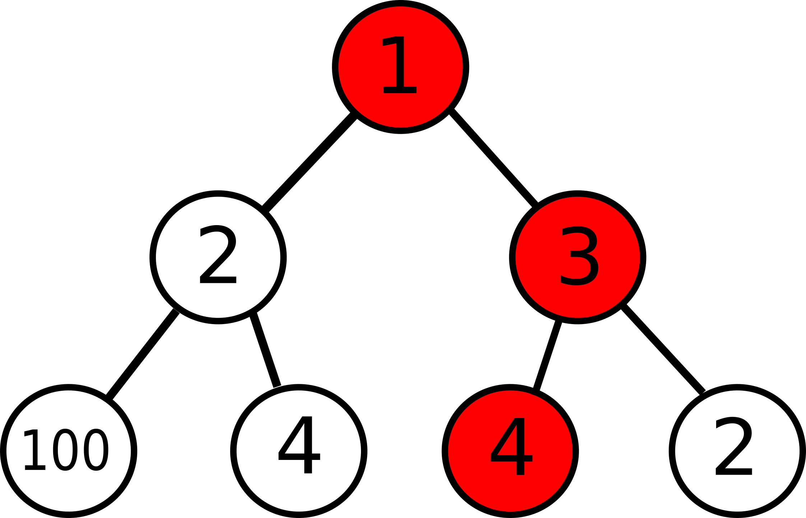

# Greedy Algorithm
Greedy algorithm is any algorithm that uses the approach of finding the locally optimal choice at each stage in problem solving.    
Greedy algorithm **does not** always result in the optimal solution, we shall see such an example in the later part of this blog.    
Let us take a look at a few problems to understand greedy algorithm.    

## Problem (Fractional Knapsack Problem)
> You have been blessed with the power to predict the prices of shares of $n$ companies a day later. You want to make maximum profit out of this oppurtunity. You can buy fraction of a share like in mutual funds, but you cannot buy more than one share of any company. Assume that you don't have to share your profit with brocker. You have $x$ rupees to begin with, your goal is to maximise the profit.   
> ### Input   
> An integer $t$ representing the number of test cases $(1 \leq t \leq 100)$. The next line contains the number of companies $n$, $(1 \leq n \leq 100)$ and the amount you have $x$, $(1 \leq x 1000)$.. The next line is a sequence of $n$ integers reprsenting the current prices of listed shares.
> ### Output
> One single integer denoting the maximum profit. (If the answer is a decimal number truncate it).
> ### Input
>> 1   
>> 4 150   
>> 60 50 80 100   
>> 120 40 200 110   
> ### Output
>> 181
> ### Explanation
> you will buy $1$ share of first company, $1$ for third company, and $0.1$ for fourth company.      

Lets discuss an approach to the problem.   
We will sort the arrays in descending order of profit ratio, that would be $80\ 50\ 100\ 50$. Notice that we would never buy a share which doesn't result in profit. The code for this problem is given below.
``` c++
#include <bits/stdc++.h>
using namespace std;

struct vals
{
  int a;
  int b;
};
typedef struct vals val;

bool cmpfunc(val l1, val l2)
{
  return (double)l1.b/l1.a>(double)l2.b/l2.a;
}

int main()
{
  ios_base::sync_with_stdio(0);
  cin.tie(0);
  cout.tie(0);
  int t;cin>>t;
  while(t--)
  {
    int n,x; cin>>n>>x;
    val l[n];
    for(int i=0;i<n;i++) cin>>l[i].a;
    for(int i=0;i<n;i++) cin>>l[i].b;
    sort(l,l+n,cmpfunc);
    int i=0,profit=0;
    while(x>=l[i].a && l[i].b-l[i].a>0 && i<n)
    {
      profit+=l[i].b-l[i].a;
      x-=l[i].a;
      i++;
    }
    if(x>0 && i<n && l[i].b-l[i].a>0)
    {
      profit+=x*(double)(l[i].b-l[i].a)/l[i].a;
    }
    cout<<profit<<'\n';
  }
}
```
You can read for fractional knasack problem [here](https://www.geeksforgeeks.org/fractional-knapsack-problem/)

Lets take a look at another problem

## Problem
> You're given two binary strings $a$ and $b$ of length $n$, your goal is to make them equal. You can perform the following two operations.     
>&nbsp; &nbsp; 1). swap any two adjacent bits, it costs 1 unit.          
> &nbsp; &nbsp; 2). flip the bit of the string, it costs 1 unit.              
> your goal is to minimise the cost of the total process
> ### Input
> The first line contains one integer that denotes the length of both strings. The next two lines take two strings $a$ and $b$ of length  as an input.
> ### Output
> Print one integer representing the minimal cost of the total operation.
> ### Sample Input
>> 4   
>> 1101    
>> 0011      
> ### Sample Output
>> 2

Now, lets try to solve this question.       
Lets say for some i, $i^{th}$ bit in both strings don't match. If the $i+1^{th}$ bit matches then we can just flip the $i^{th}$ bit. We shall consider only the $i+1^{th}$ bit because we would check for mis matches in increasing order of $i$, it is unreasonable to swap any non adjacent bits because it take $2|i-j|-1$ units for distinct $i$ and $j$, while it takes only $2$ units to flip the bits. From this comparison, it can be seen that swap only requires 1 unit for adjacent bits while flip requires 2. So, it is optimal to swap adjacent bits if $a_i \neq b_i$ , $a_{i+1} \neq b_{i+1}$ and $a_i \neq a_{i+1}$.

The code is given below
``` c++
#include <bits/stdc++.h>
using namespace std

int main()
{
  ios_base::sync_with_stdio(0);
  cin.tie(0);
  cout.tie(0);
  int n,cost=0;
  cin>>n;
  string a,b;
  cin>>a>>b;
  a[n]=b[n]='0';
  for(int i=0;i<n;i++)
  {
    if(a[i]!=b[i])
    {
      cost++;
      if(a[i]!=a[i+1] && b[i+1]!=a[i+1])i++;
    }
  }
      cout<<cost<<'\n';
}
 ```  
The orignal question can be viewed [here](https://www.hackerearth.com/practice/algorithms/greedy/basics-of-greedy-algorithms/practice-problems/algorithm/string-equalizer-d4a539ba/)    


## When does greedy algorithm fail?
Greedy algorithm is hort-sighted and only selects the locally optimal solution. This doesn't guarentee that we will get globally optimal soltion. An example can be seen below   



Lets say we have to maximise the sum of elements on some branch. The greedy approach is to select the maximum element at each level, which is the red ones in the given example. However, it can be easily observed that this is way worse than the optimal solution. This is why it is important to understand what greedy algorithm does.    
Greedy algorithm doesn't always produce a solution that is as good as the optimal solution, it is still important because it can help reduce a lot of steps involved.


## Some content goes here

>Raju and Farhan are two friends, they are working on a program together. Raju spends n minutes working on code, while Farhan spends m minutes working on the code. At any minute only one of them works on the code. The can perform one of the following two operations at in one minute.    
&nbsp; &nbsp; 1. Write a new line of code at the end.    
&nbsp; &nbsp; 2. modify $x^{th}$ line, given that $x^{th}$ line exists.   
> There are $k$ lines of code already when they start working.
> We are given the sequence of operations made by the friends, Raju performs $[a_1,\ a_2,... ,\ a_n]$, if $a_i=0$ then Raju adds a new line to the code, else he modifies the $a_i^{th}$ line. Similarly, for Farhan you are given a sequence $[b_1,\ b_2,...,\ b_m]$. It is known that the sequence of operationa made by both Raju and Farhan are in order, i.e; $a_i$ is done before $a_j$ if $j>i$ and $b_i$ is done before $b_j$ if $j>i$. They can replace each other at the computer any number of times. Your goal is to find any one of the correct sequence of operations (if there exists one), a sequence is considered correct if there are no changes to the lines which do not exist then.       
> ### Input 
> The number of test cases t $(1\leq t \leq 1000)$, for each test case your are given three integers $k$, $n$ and $m$, followed by the sequences $[a_1,\ a_2,... ,\ a_n]$ and $[b_1,\ b_2,...,\ b_m]$, &nbsp; $(0\leq a_i,b_i\leq 300)$
> ### Output
> For each test case print any correct common sequence of Raju's and Farhan's actions of length n+m or -1 if such sequence doesn't exist
> ### &nbsp; &nbsp;Input  
>> 5
>>
>>3 2 2   
>>2 0   
>>0 5   
>>   
>>4 3 2   
>>2 0 5   
>>0 6   
>>  
>>0 2 2   
>>1 0   
>>2 3  
>>   
>>5 4 4   
>>6 0 8 0   
>>0 7 0 9   
>>   
>>5 4 1   
>>8 7 8 0   
>>0
> ### &nbsp; &nbsp; Output
>> 2 0 0 5     
>>0 2 0 6 5    
>>-1    
>>0 6 0 7 0 8 0 9    
>>-1    
> ### Explanation
> For fourth test case, Raju cannot work in the beginning because the sixth line doesn't exist as of yet, So first Farhan will write a new line followed by Raju editing 6th line and then adding a new line, followed by Farhan editing the seventh line and so on. It is easy to understand that this is the only possible sequence of operation. 

Let us discuss the approach for solving this problem.
This problem is rather easy and we just need one rule,   
*don't update a line which doesn't exist*       
Start with Raju's work, if at some point we have to update a line that doesn't exist, we will switch to Farhan for one task, if Farhan adds a line then we will repeat the above procedure, else return -1.

The code for the above problem is given below
``` c++
#include<bits/stdc++.h> 
 
using namespace std;   
#define ld long double
 
int main()
{
    ios_base::sync_with_stdio(false); 
    cin.tie(0);  
    cout.tie(0);
    int t;
    cin>>t;
    while(t--)
    {
      int k,a,b;
      cin>>k>>a>>b;
      int aa[a],bb[b];
      for(int i=0;i<a;i++)cin>>aa[i];
      for(int i=0;i<b;i++)cin>>bb[i];
      int i=0,j=0,flag=1;
      int s[a+b];
      while(i<a && flag)
      {
            if(aa[i]==0){k++;s[i+j]=0;i++;}
            else if(aa[i]<=k){s[i+j]=aa[i];i++;}
            else if(j<b)
            {
              if(bb[j]==0){k++;s[i+j]=0;j++;}
              else if(bb[j]<=k){ s[i+j]=bb[j]; j++;}
              else{flag=0;}
            }
            else flag=0;
      }
      while(j<b && flag)
      {
        if(bb[j]==0){k++; s[i+j]=0; j++;}
        else if(bb[j]<=k){ s[i+j]=bb[j]; j++;}
        else{flag=0;}
      }
      if(flag)
      {
        for(i=0;i<a+b;i++)cout<<s[i]<<' ';
      }
      else
      cout<<"-1";
      cout<<'\n';
 
 
  
```


