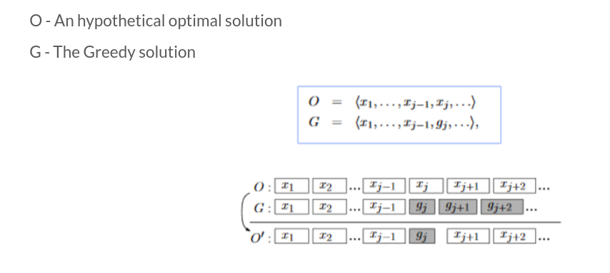

# Greedy Algorithm              
Greedy algorithm is any algorithm that uses the approach of finding the locally optimal choice at each stage in problem solving, greedy algorithm is mostly used in optimisation problem.    
Greedy algorithm **does not** always result in the optimal solution, we shall see such an example in the later part of this blog.    
Let us take a look at a few standard problems to understand greedy algorithm.    

## Problem (Fractional Knapsack Problem)              
> You have been blessed with the power to predict the prices of shares of $n$ companies a day later. You want to make maximum profit out of this oppurtunity. You can buy fraction of a share like in mutual funds, but you cannot buy more than one share of any company. Assume that you don't have to share your profit with brocker. You have $x$ rupees to begin with, your goal is to maximise the profit.   
> ### Input               
> An integer $t$ representing the number of test cases $(1 \leq t \leq 100)$. The next line contains the number of companies $n$, $(1 \leq n \leq 100)$ and the amount you have $x$, $(1 \leq x \leq 1000)$.. The next line is a sequence of $n$ integers reprsenting the current prices of listed shares.
> ### Output             
> One single integer denoting the maximum profit. (If the answer is a decimal number truncate it).
> ### Input           
>> 1   
>> 4 150   
>> 60 50 80 100   
>> 120 40 200 110   
> ### Output            
>> 181 
> ### Explanation        
> you will buy $1$ share of first company, $1$ for third company, and $0.1$ for fourth company.      

Lets discuss an approach to the problem.   
We will sort the arrays in descending order of profit ratio, that would be $80\ 50\ 100\ 50$. Then, we would start buying the shares in descending order until we run out of money. Notice that we would never buy a share which doesn't result in profit. The code for this problem is given below.
``` c++
#include <bits/stdc++.h>
using namespace std;

struct vals
{
  int a;
  int b;
};
typedef struct vals val;

bool cmpfunc(val l1, val l2)
{
  return (double)l1.b/l1.a>(double)l2.b/l2.a;
}

int main()
{
  ios_base::sync_with_stdio(0);
  cin.tie(0);
  cout.tie(0);
  int t;cin>>t;
  while(t--)
  {
    int n,x; cin>>n>>x;
    val l[n];
    for(int i=0;i<n;i++) cin>>l[i].a;
    for(int i=0;i<n;i++) cin>>l[i].b;
    sort(l,l+n,cmpfunc);
    int i=0,profit=0;
    while(x>=l[i].a && l[i].b-l[i].a>0 && i<n)
    {
      profit+=l[i].b-l[i].a;
      x-=l[i].a;
      i++;
    }
    if(x>0 && i<n && l[i].b-l[i].a>0)
    {
      profit+=x*(double)(l[i].b-l[i].a)/l[i].a;
    }
    cout<<profit<<'\n';
  }
}
```
You can read for fractional knasack problem [here](https://www.geeksforgeeks.org/fractional-knapsack-problem/)

## Problem (Job Sequence)              
> You are a working as a freelancer, you find $n$ tasks, each task takes you a day to complete and has certain profit. Your client wants the task to be completed in certain time range. Pick the tasks to maximise your profit.
> ### Input          
> An integer $n\ (n \leq 10)$ representing the number of tasks available, the next line contains $n$ integers representing the profit generated from each (Sum being less than $10^6$), followed by $n$ integers representing the deadline for each task $(\leq n)$  
> ### Output         
> A single integer representing the maximum profit
> ### Input           
>> 6      
>> 10 20 30 40 50 100    
>> 1 1 3 3 4 4
> ### Output            
>> 220    
> ### Explanation           
> The tasks that are picked are such that the profit is maximised, we will pick the tasks with profit $30, \, 40,\, 50,\, 100$ 

### Solution             
Since, we want the maximum profit, we'll try to do all the tasks that result in higher profit. First arrange the tasks in descending order of profit, Now start checking if a task can be done or not. For that assign each task that is being done to a particular day. Assign it to the day that is still not occupied with another task such that it is close to deadline.

``` c++
#include <bits/stdc++.h>
using namespace std;

typedef struct Data
{
  int profit;
  int deadline;
} Data;

bool cmpfunc(Data a, Data b)
{
  return a.profit>b.profit;
}

int main()
{
  ios_base::sync_with_stdio(0);
  cin.tie(0);
  cout.tie(0);

  int n; cin>>n;
  Data data[n];
  for(int i=0;i<n;i++) cin>>data[i].profit;
  for(int i=0;i<n;i++) cin>>data[i].deadline;

  // arranging the taks in descending order of profit
  sort(data,data+n,cmpfunc);   
  int max_deadline=0;
  for(int i=0;i<n;i++)
    if(max_deadline<data[i].deadline)
      max_deadline=data[i].deadline;

  // at max max_deadline tasks can be completed
  bool booked[max_deadline];
  for(int i=0;i<max_deadline;i++)booked[i]=false;
  int profit=0;
  for(int i=0;i<n;i++)
  {
    int j=data[i].deadline-1;
    while(booked[j] && j>-1)j--;
    if(j!=-1){profit+=data[i].profit; booked[j]=true;}
  }

  cout<<profit<<'\n';
}
```

## Activity Selection Problem                   
> You have enrolled in several courses without looking the time clash between the courses, the add-drop period is over, so now you want to attend the maximum number of lectures. You goal is to determine how many lectures you can attend.
> ### Input            
> An integer $n$ representing the number of courses, followed by a line containing $n$, $(n \leq 10)$ integers representing the starting time for each course. The next line contains $n$ integers representing the ending time of each lecture. Apparently, the lectures aren't the usual $1$ hr or $1.5$ hr ones. Assume the any required calculation doesn't exceed $10^6$
> ### Output                
> A single integer representing the maximum number of lectures you can attend. Please note that you have to attend maximum number of lectures, they need not be longer ones.
> ### Input                
>> 5   
>> 10 15 30 90 0   
>> 20 30 70 110 25
> ### Output             
>> 3

### Solution                
There may be a few intutions regarding the greedy approach like selecting the lecture that begins first, or may be ends first, or is for least duration. The greedy solution is actually the one in which we are ordering the lectures end time.   
Here, it would be 
> 20 25 30 70 110

So we will select the lecture that ends at 20, then we will try selecting the next feasible lecture, we can't select the lecture that ends at 25 because it clashes with the first lecture that we selected, we cannot select the lecture that ends at 30 for same reason. We would then select the lectures that ends at 70 and 110. We were able to select 3 lectures. This is a greedy solution, but it is worth noting that there are other solutions which are as good as greedy solution here.   
Proving that the greedy solution is as good as optimal solution is important because there are multiple greedy techniques and not all would be optimal. Since, greedy techniques are mostly intution based, understanding the mathematics behind it becomes important.

## Exchange Arguments             
This is a method which comes especially useful while trying to prove greedy algorithms.       
We have two sets of solutions: one the optimal set and another the greedy set. On the first point of difference, we try to reason that the greedy solution is at least as good or _better_ than the optimal solution. Hence, eliminating that difference, won’t make any difference.       
We continue this process till the end until the optimal solution matches the greedy solution.  
Consider the following


 
Assume the optimal solution and greedy solution are same till the term $x_{j-1}$, later since $g_j$ is the lowest feasible end time, it has to be $\leq x_j$. Further, it can be seen that similar inequality is applicable for all subsequent terms. If there are $k$ lectures in optimal solution, we get $x_{k-1} \leq g_{k-1}$, Therefore, there are equal or more choices available for last lecture in greedy solution. Note that since greedy solution cannot be better than optimal solution, greedy solution will also have $k$ lectures.


## When does greedy algorithm fail?
Greedy algorithm is hort-sighted and only selects the locally optimal solution. This doesn't guarentee that we will get globally optimal soltion. An example can be seen below   


Lets say we have to maximise the sum of elements on some branch. The greedy approach is to select the maximum element at each level, which is the red ones in the given example. However, it can be easily observed that this is way worse than the optimal solution. This is why it is important to understand what greedy algorithm does.    
Greedy algorithm doesn't always produce a solution that is as good as the optimal solution, it is still important because it can help reduce a lot of steps involved.
In case of 0-1 knapsack problem, the greedy approach may not lead to optimal solution, it would only ensure a local optima for selection of items.

Here is one easy greedy algorithm problem
> You are given an array of $n$ integers, you have to select a bunch of numbers, lets say $a_1,a_2,a_3,..,a_k$, your goal is to maximise $\displaystyle \sum_{i=1}^{k}(-1)^{i-1}a_i$, find this maximum value
> ### Input                 
>> an integer $n$, $n<100$ representing the number of integers in the array, followed by $n$ integers. Assume all the integers are less than $1000$ and greater than $0$, all the numbers in the array are distinct.
> ### Output           
> > A single integer representing the maximum value of above mentioned expression
> ### Input           
>> 8    
>> 7 2 4 6 9 1 5 11 
> ### Output          
> > 25

## Solution       
Since all the numbers are positive we would always have an odd number of numbers in the desired solution because if there are even number of integers we can always drop the last integer in the desired array to make the expression larger. It is optimal to select local maximas as odd index elements in desired array and local minima as even index elements in desired array. This again seems very intuitive but being able to prove the results is important to avoid WA.
It is easy to observe that by changing some local maxima or minima in desired solution to some other number would result is lower value of expression, removing a pair of values would also result in lower value of expression because the value of pair is positive, adding a pair in between is also going to decrease the value of expression because the pair would essentially be added in between a local maxima and minima, the even index value added would be greater than the odd index term thus decreasing the value of expression.